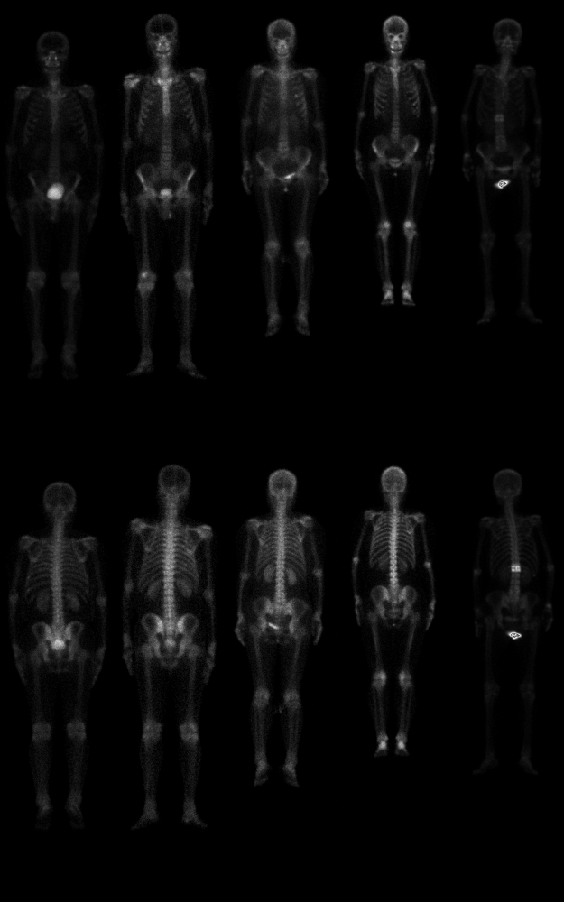
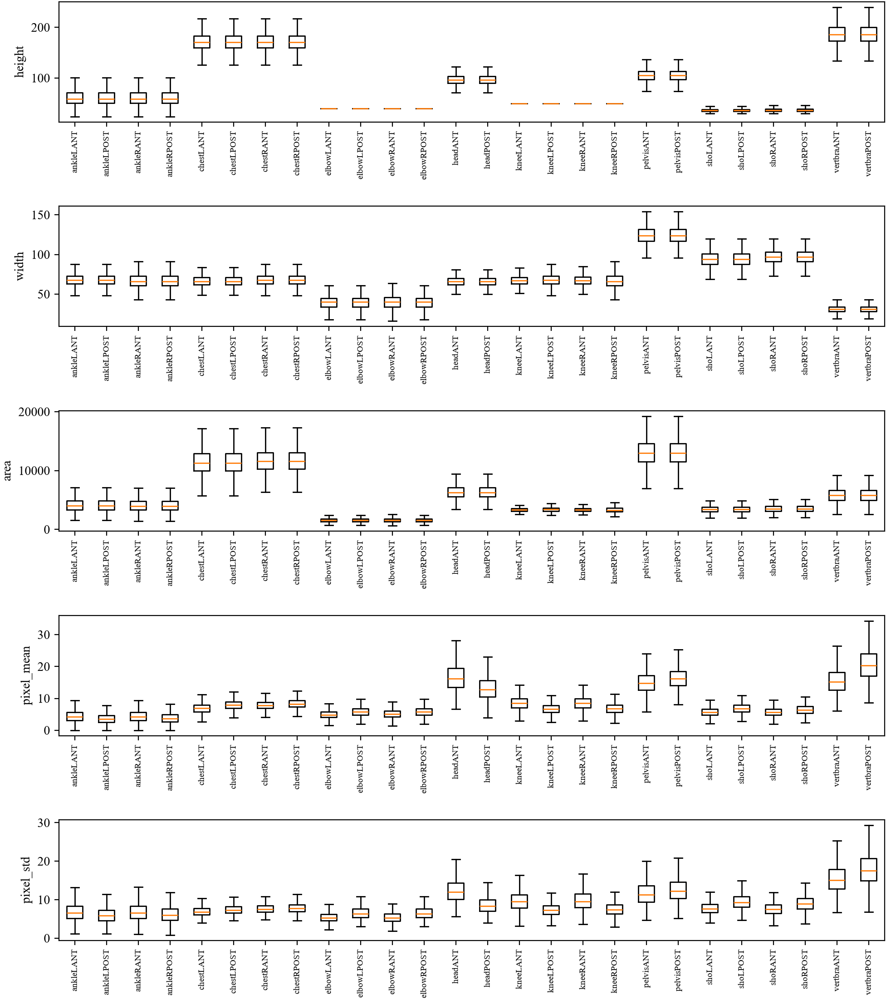
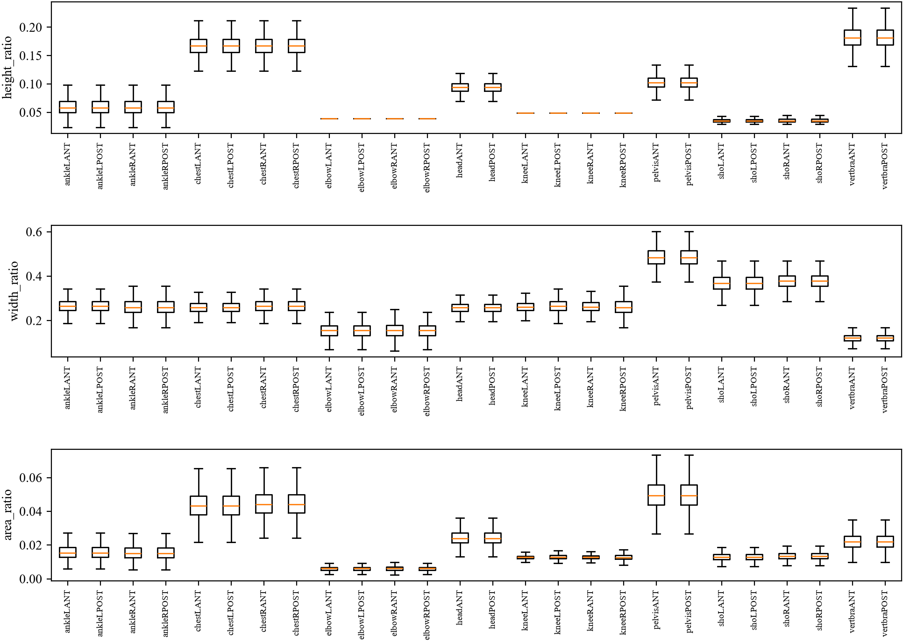

# bs80k bone region bounding box

Recovering where cropped bone scan regions sit inside their whole body source images, as bounding boxes, via template matching.

## Problem

The BS-80K bone scan dataset provides whole body scans and cropped bone region images taken from them, but never records where a crop sits inside its source image. This project recovers that location as a bounding box.

## Samples

5 paired anterior/posterior whole body scans, top row anterior, bottom row posterior, matched by column.

The same pairing across bone regions: ankle, chest, elbow, head, knee, pelvis, shoulder, vertebra.

## Statistics

Image size, pixel value, and crop-to-whole-body size ratio, across all region and view combinations.

## Status

A plain template matching baseline is in and tested on a sample across every region. It locates 18 of 26 region types essentially exactly, one region group is close but not pixel exact as expected, and two are clearly weaker and not yet explained.
