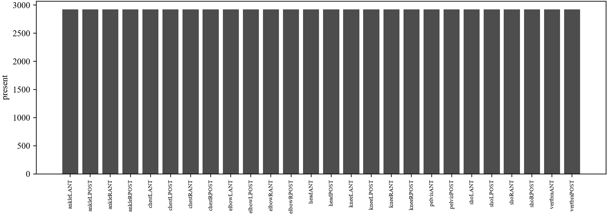

# bs80k bone region bounding box

Template matching to recover bounding box annotations for the bs80k dataset.

Repo: https://github.com/Liamours/bs80k-bone_region-bounding_box

## Problem

Each sample has a raw image and a cropped image taken from it. The crop's location inside the raw image is not recorded anywhere. This project derives that location as a bounding box.

## Input / output

- Input: raw image, cropped image
- Output: bounding box (x, y, width, height) of the crop inside the raw image

## Structure

- `intent.md` - what this project is for and what counts as done
- `AGENTS.md` - instructions for any coding agent working in this repo
- `CLAUDE.md` - Claude Code specific notes
- `.claude/skills/` - reusable skill definitions
- `context/` - background notes on the dataset and the matching approach
- `src/analysis/` - scripts for sample figures and dataset statistics
- `result/dataset_samples/` - sample figures from the raw dataset
- `result/tables/` - statistics as Excel tables
- `result/figures/` - figures generated from those tables

## Samples

5 paired anterior/posterior whole body scans, top row anterior, bottom row posterior, matched by column.

Same 5 paired samples per bone region, top row anterior, bottom row posterior. Generated by `src/analysis/region_samples.py`, output in `result/dataset_samples/`.

- ankleL, ankleR
- chestL, chestR
- elbowL, elbowR
- head
- kneeL, kneeR
- pelvis
- shoL, shoR
- vertbra

## Statistics

Tables in `result/tables/`, generated by `src/analysis/component_coverage.py`, `image_stats.py`, and `crop_size_ratio.py`.

Figures in `result/figures/`, generated from those tables by `src/analysis/stat_figures.py`.

## Status

Scaffold plus analysis scripts for sample figures and dataset statistics. No matching code has been written or run yet.
