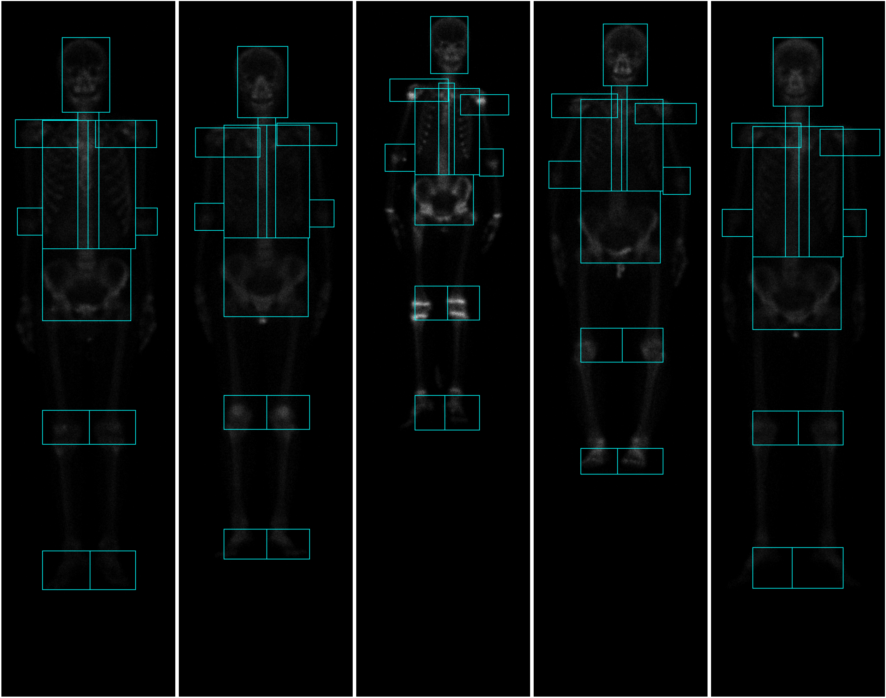

# bs80k bone region bounding box

Recovering where cropped bone scan regions sit inside their whole body source images, as bounding boxes, via template matching.

## Problem

The BS-80K bone scan dataset provides whole body scans and cropped bone region images taken from them, but never records where a crop sits inside its source image. This project recovers that location as a bounding box.

## Samples

5 paired anterior/posterior whole body scans, top row anterior, bottom row posterior, matched by column.

The same pairing across bone regions: ankle, chest, elbow, head, knee, pelvis, shoulder, vertebra.

## Statistics

Image size, pixel value, and crop-to-whole-body size ratio, across all region and view combinations.

## Predictions

5 whole body scans with every predicted region bounding box outlined on top, blue, 1 pixel.

## Quality metrics

Mean of each per row pixel metric, 2925 predictions per component (`src/eval/quality_table.py`, full table in [result/figures/bounding_box_quality.md](result/figures/bounding_box_quality.md)). near exact and ssim are the headline numbers, the rest diagnose why.

| component | near exact | ssim | match score |
|---|---|---|---|
| every region except shoulder (24 of 26) | ~1.00 | ~0.996-0.999 | ~0.994-0.999 |
| shoulder, anterior (2 of 26) | ~0.243 | ~0.567-0.574 | ~0.563-0.569 |
| shoulder, posterior (2 of 26) | ~0.245 | ~0.578-0.595 | ~0.558-0.573 |

## Status

Template matching locates 24 of 26 region types essentially exactly, once the search excludes background where needed and evaluation always does. Shoulder, the remaining region type, anchors its search on the already-matched vertebra position rather than searching the whole image, cutting its failure rate roughly in half to two thirds, anterior view is now close to every other region, posterior view is improved but still elevated. Its remaining precision gap (near-exact fraction ~0.24 vs ~1.0 elsewhere) was revisited and closed as an accepted limitation of a rectangular bounding box approach, see `context/method.md`, not something still being actively chased. Run across the full dataset, 76050 predictions.
